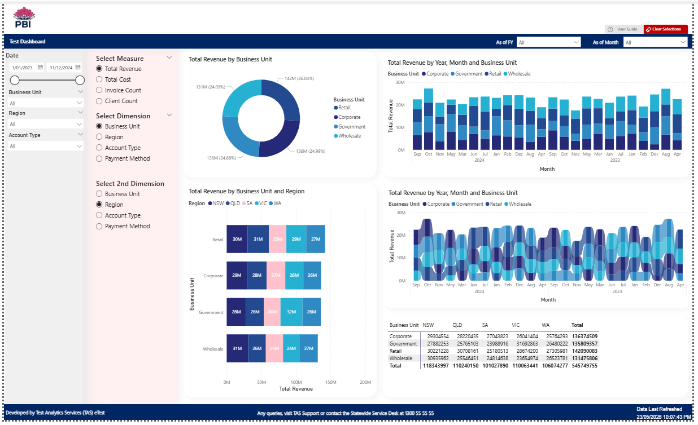
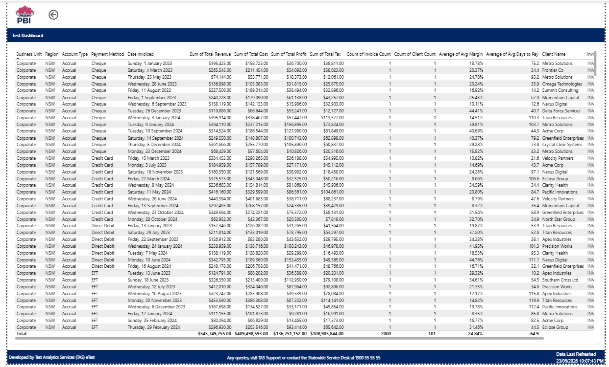
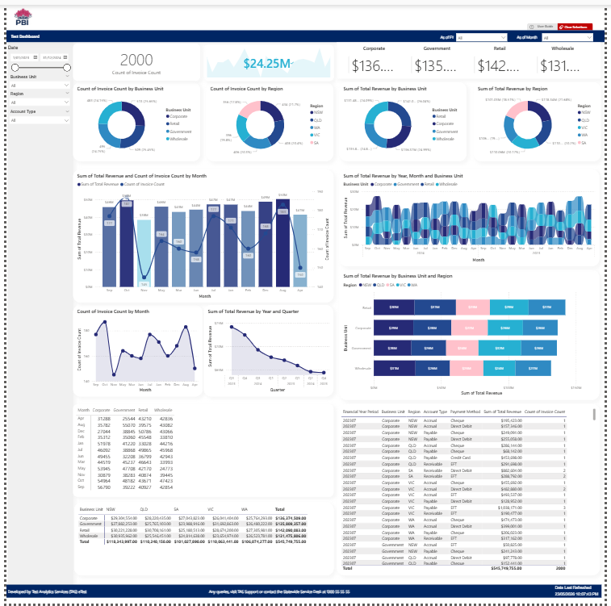

<div align="center">

# 🎨 pbi-drafter

### Turn a config file into a Power BI dashboard. In minutes.

[](https://python.org)
[](#-test-coverage)
[](#-license)
[](https://learn.microsoft.com/en-us/power-bi/developer/projects/)
[](https://claude.ai/code)

<br>

**Before:** 1 week to first prototype. Every dashboard looks different. AI can't touch PBIX.

**After:** Config file → AI agent → near-complete dashboard before lunch. Every time. Consistent.

<br>

## 🎬 Quick Demo


*One config. One command. One dashboard.*

## 📺 How It Works (Video Walkthrough)

<div align="center">

[](https://www.youtube.com/watch?v=fUtpsnyUmpU)

*▶ Click to watch on YouTube*

</div>

</div>

---

## 💡 What is this?

Dashboard Drafter is an AI-powered pipeline that generates **near-complete Power BI dashboards** from a single configuration block.

You write this:

```sql
/*FACTORY
TITLE: HR Dashboard
SOURCE: hr_data.csv
1.SUM: ①SUM_Measure_1 AS "Total Budget"($#,0.00)
4.DATE: DateKey AS "Date Reported"
5.KEY: ①Key_Dim_1 AS "Department" ②Key_Dim_2 AS "City"
*/
```

And get this:

| Page | What you get |
|---|---|
| 📊 **Summary** | KPIs, Combo Chart, Top-N ranking |
| 🔍 **Ad-Hoc** | Matrix + Slicers + dynamic Field Parameters |
| 📋 **Details** | Full row-level detail table |
| 🎨 **Visual Objects** | Pre-built chart library — pick what you need |
| 🔎 **Drillthrough** | Click any row → drill down to detail |

---

## 🔥 Three problems. One tool.

<table>
<tr>
<td width="33%" align="center">

### ☕ The Barista Problem

Same template. Different developer. Different result.

Design drifts, credibility drops.

</td>
<td width="33%" align="center">

### 🏓 The Ping-Pong Problem

1 week to first prototype.

"Not what I meant." Repeat.

</td>
<td width="33%" align="center">

### 🔒 The Binary Problem

PBIX = binary = AI can't touch it.

Until PBIP (Nov 2025).

</td>
</tr>
</table>

---

## 🏗️ How it works
                ┌─────────────────┐
                │  /*FACTORY*/    │
                │  Config Block   │
                └────────┬────────┘
                         │
                ┌────────▼────────┐
                │  🤖 AI Pipeline │
                │                 │
                │  1. M Query Gen │
                │  2. Rename      │
                │  3. Visibility  │
                │  4. Format      │
                │  5. Field Params│
                │  6. Sort        │
                └────────┬────────┘
                         │
                ┌────────▼────────┐
                │  📊 Dashboard   │
                │  5 pages, ready │
                │  Open in PBI    │
                └────────┬────────┘
                         │
                ┌────────▼────────┐
                │  👨‍💻 Developer   │
                │  Final polish   │
                │  Ship it        │
                └─────────────────┘

**What the AI does:** Copies a template with 40 placeholder slots → maps your data → renames fields to business names → hides unused columns → applies number formats → configures Field Parameters → removes stale references. All tested. All automated.

**What you do:** Open in Power BI Desktop. Polish. Publish.

---

## 📸 Screenshots

<table>
<tr>
<td width="50%">

### 📊 Summary Page


</td>
<td width="50%">

### 🔍 Ad-Hoc Analysis


</td>
</tr>
<tr>
<td width="50%">

### 📋 Details Page


</td>
<td width="50%">

### 🔎 Drillthrough


</td>
</tr>
</table>

<details>
<summary>🎨 Visual Objects Library (Hidden Page)</summary>



*Pre-built charts ready to copy-paste into your dashboard.*

</details>

---

## 🚀 Quick Start

```bash
# Clone the repo
git clone https://github.com/yujiyamane/pbi-ai-skills.git
cd pbi-ai-skills/pbi-drafter

# Install dependencies
pip install -r requirements.txt

# Generate sample data
python examples/sample_data_generator.py

# Write your config, pass to Claude Code:
# "Generate a dashboard from this config"
```

---

## 📝 Config Block Format

```sql
/*FACTORY
TITLE: Finance Dashboard
THEME(1:nsw-blue): 1
DB(1:Oracle 2:PostgreSQL 3:Snowflake 4:CSV 5:Excel): 4
SOURCE: C:\data\finance.csv

1.CNT(max5):  ①CNT_Measure_1 AS "Invoice Count"
2.SUM(max10): ①SUM_Measure_1 AS "Revenue"($#,0.00) ②SUM_Measure_2 AS "Cost"($#,0.00)
3.AVG(max5):  ①AVG_Measure_1 AS "Margin"(%)
4.DATE:       DateKey AS "Invoice Date"
5.KEY(max10): ①Key_Dim_1 AS "Region" ②Key_Dim_2 AS "Product"
6.OTHER:      Other_Field_1 AS "Client Name"
*/
```

| Slot Type | Capacity | Aggregation |
|---|---|---|
| `SUM` | 10 | Sum |
| `CNT` | 5 | Distinct Count |
| `AVG` | 5 | Average |
| `KEY` | 10 | Group-by dimension |
| `OTHER` | 10 | Detail field |
| `DATE` | 1 | Date dimension key |

---

## ⚠️ Limitations

> **Honesty builds trust.** Here's what Dashboard Drafter can't do yet.

- 🔸 **Single fact table + single date dimension** — complex star schemas need manual customisation
- 🔸 **Flat fact table** — not optimised for very large datasets. Developers add star schema during polish.
- 🔸 **One template covers most designs.** For complex models (dual fact tables, multiple dimensions), create additional templates.

---

## 🧪 Test Coverage
350 tests passing
├── config_parser      — Config block parsing
├── mquery_generator   — M Query generation + type conversion
├── rename_pipeline    — TMDL + visual.json + page.json + relationships + Field Parameters
├── visibility_pipeline— Hidden columns + projection removal + drillthrough cleanup
├── format_pipeline    — Number format application
├── sort_pipeline      — Sort-by-column configuration
└── factory            — End-to-end orchestration

Every bug found is permanently fixed with a regression test. TDD from day one.

---

## 🗺️ Roadmap

- [ ] SQL source support (Oracle, PostgreSQL, Snowflake)
- [ ] CLI tool (`python generate.py config.sql`)
- [ ] Theme swap automation
- [ ] Multi-template support
- [ ] Tooltip chart support
- [ ] CI/CD integration with Azure DevOps
- [ ] User Guide Drafter integration (POC built and ready)

---

## 📄 License

MIT © 2026 [Yuji Yamane](https://github.com/yujiyamane)

---

<div align="center">

**Built with** [Claude Code](https://claude.ai/code) **by Anthropic**

**Powered by** [PBIP / PBIR / TMDL](https://learn.microsoft.com/en-us/power-bi/developer/projects/)

*PBIP makes AI possible.*

</div>
